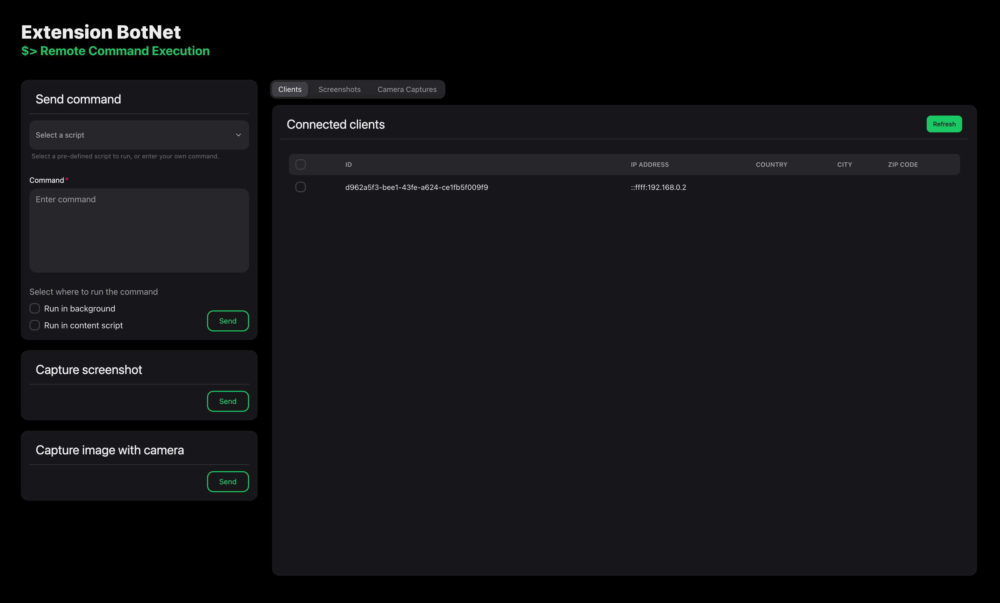

---
> Disclaimer: This project is for educational purposes only. I do not take any responsibility for the misuse of this project.
---
<!-- TOC --> 
* [Malicious Chrome Browser Extension](#malicious-chrome-browser-extension)
    * [Requirements](#requirements)
    * [Usage](#usage)
        * [Online Demo Access](#online-demo-access)
        * [Local](#local-)
        * [Attacker Portal](#attacker-portal)
        * [Chrome Extension](#chrome-extension)
    * [Setup](#setup)
        * [Attacker Portal](#attacker-portal-1)
        * [C&C Server](#cc-server)
        * [Chrome Extension](#chrome-extension-1)
        * [Infrastructure](#infrastructure)
<!-- TOC -->
# Malicious Chrome Browser Extension
This browser extension is for showcasing the possibilities of remote code execution through a botnet created through a malicious browser extensions.

It consists of four parts:
1. Chrome browser extension [./extension](./extension)
2. Node.js C&C server [./server](./server)
3. Web app - Attackers control panel [./webapp](./web)
4. Infrastructure setup [./infrastructure](./infra)

This document will guide you through the setup and usage of this project.

## Requirements
- Node.js >= 18.0.0
- npm >= 7.0.0
- Docker >= 20.0.0
- Google Chrome >= 116
- Terraform >= 1.0.0

## Usage
### Online Demo Access
- The attacker portal is deployed for demo purposes on a public server, and you can access it at https://extension-code-injector.vercel.app/ .
- The C&C server is deployed for demo purposes on a public server, and you can access it at https://extension-code-injector-production.up.railway.app/ .
### Local 
- If you wish to run the project locally, follow the steps in the [Setup](#setup) section

### Attacker Portal
The attacker portal is a web application that allows the attacker to control the botnet. The attacker can:
- view the list of connected bots
- send commands to the bots
- take camera captures and screenshots on the bots
- view the captured camera images and screenshots 
The screenshot on the top of this document shows the UI of the attacker portal.
### Chrome Extension
To be able to connect your browser to the Botnet, you need to load the chrome extension locally as an unpacked extension in your Chrome browser. You can do this by following the steps in the [Setup > Chrome Extensions](#chrome-extension) section.

The extension will connect to the C&C server and wait for commands to execute on the user's browser. In terms of the legitimate functionality, by clicking on the icon of the extension, you can toggle a dark mode view of the current webpage.

## Setup
To run the project locally, you need to set up the infrastructure, C&C server, and attacker portal. Follow the steps below to set up the project.
> Note: The infrastructure setup is partially required, as the C&C server needs to be able to save the data to the S3 blob storage. More details on how to only build the S3 bucket can be found in the [Infrastructure](#infrastructure) section.
### Attacker Portal
The attacker portal is a React.js web application. To run the attacker portal, you can do follow two different methods:
1. Run the attacker portal from the source code
   1. Navigate to the `web` directory.
   2. Create an `.env` file for the environment variables. You can copy and rename the `.env.example` file and fill in the required values.
   3. Install dependencies by running `npm install`.
   4. Start the development server by running `npm start`.
   5. The attacker portal is now running, you can access it at `http://localhost:$PORT` where `$PORT` is the port specified in the `.env` file.
2. Build the source code and run the attacker portal from the build files
   1. Navigate to the `web` directory.
   2. Create an `.env` file for the environment variables. You can copy and rename the `.env.example` file and fill in the required values.
   3. Install dependencies by running `npm install`.
   4. Build the source code by running `npm run build`.
   5. The build files will be created in the `web/build` directory.
   6. Now you can serve the static files using a static file server like `serve` or `http-server`. For example, you can run `npx serve -s build` to serve the build files.
### C&C Server
The C&C server is a Node.js server that manages the botnet. To run the C&C server, you can follow two different methods:
1. Run the C&C server from the source code
   1. Navigate to the `server` directory.
   2. Create an `.env` file for the environment variables. You can copy and rename the `.env.example` file and fill in the required values.
   3. Install dependencies by running `npm install`.
   4. Start the server by running `npm start`.
   5. The server is now running, you can access it at `http://localhost:$PORT` where `$PORT` is the port specified in the `.env` file.
2. Run the C&C server from Docker
   1. Navigate to the `server` directory.
   2. Create an `.env` file for the environment variables. You can copy and rename the `.env.example` file and fill in the required values.
   3. Build a docker image by running `docker build -t cc-server .`.
   4. Start the server by running `docker run -p $PORT:$PORT --env-file .env cc-server` where `$PORT` is the port you want to expose the server on. 
   5. The server is now running, you can access it at `http://localhost:$PORT` where `$PORT` is the port specified in the `.env` file.
### Chrome Extension
To load the chrome extension locally, follow the steps below:
1. Navigate to the `extension` directory.
2. Open the Chrome browser and navigate to `chrome://extensions/`.
3. Enable developer mode by toggling the switch on the top right corner.
4. Click on the `Load unpacked` button.
5. Select the `extension` directory.
6. The extension will now be loaded in the browser and will be active.

### Infrastructure
The infrastructure setup consists of the following services:
- AWS S3 bucket
- AWS ECR container registry
- AWS ECS container service cluster
- AWS ELB load balancer

To setup the infrastructure, follow the steps below:
1. Navigate to the `infrastructure` directory.
2. Export the required environment variables to authenticate with AWS by running the following:
   ```bash
   % export AWS_ACCESS_KEY_ID="anaccesskey"
   % export AWS_SECRET_ACCESS_KEY="asecretkey"
   % export AWS_REGION="us-west-2"
   ```
2. To validate the terraform configuration, run `terraform validate`.
3. To plan the infrastructure setup, run `terraform plan`.
4. To apply the infrastructure setup, run `terraform apply`.

Terraform will build the necessary infrastructure.

In case you want to only build the S3 bucket, comment out the other resources in the `main.tf` file and run the steps from above.
